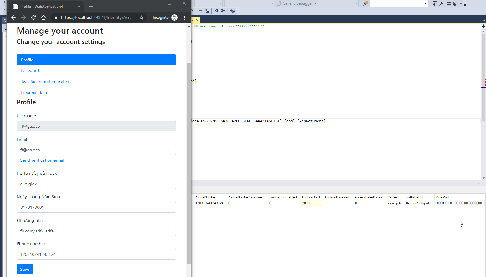

# New project
## Web asp.net core mvc + authen individual user account --> store in app


## Build, run project, register user


Case1:
CAN NOT - Edit Data > Migration > ApplicationDbContextModelSnapshot.cs
```
	modelBuilder.Entity("Microsoft.AspNetCore.Identity.IdentityUser", b =>
	                {
			…
			b.Property<DateTime>("DOB");
			b.Property<string>("HoTen").HasMaxLength(50);
			b.Property<string>("LinkNhaFB").HasMaxLength(256);
			…
```

### Add-Migration init
### Update-Database


Data > new class MyCustomUser.cs
```
 public class MyCustomUser : IdentityUser
    {
        [PersonalData]
        public string HoTen { get; set; }

        [PersonalData]
        public DateTime NgaySinh { get; set; }

        [PersonalData]
        public string LinKNhaFB { get; set; }
    }
```

ApplicationDbContext.cs
```
	public class ApplicationDbContext : IdentityDbContext<MyCustomUser>
	…
```


_LoginPartial.cshtml
```
	@inject SignInManager<WebApplication4.Data.MyCustomUser> SignInManager
	@inject UserManager<WebApplication4.Data.MyCustomUser> UserManager
```

Startup 
```
	ConfigureServices
		services.AddDefaultIdentity<MyCustomUser>()
```

### Add-Migration CustomUser1
### Update-Database
### Case1 remove 20190428161315_Init.cs
### Update-Database


check DB table --> already have custom field


Run project


Need to change Register Page to allow filled in custom field
Or After login, in manage page


Areas > add scrafold item > identity > 
	~/Views/Shared/_Layout.cshtml
	file Account\register (Optional) and Account\Manage\index
	ApplicationDbContext


		
		
		

register pageModel (Optional)
```
  public class InputModel
	        {
	            [Required]
	            [DataType(DataType.Text)]
	            [Display(Name = "Tên Đầy Đủ")]
	            public string HoTen { get; set; }
	
	            [Required]
	            [Display(Name = "Ngày Sinh")]
	            [DataType(DataType.Date)]
	            public DateTime NgaySinh { get; set; }
	
	            [Required]
	            [DataType(DataType.Text)]
	            [Display(Name = "FB tường nhà")]
	            public string LinkNhaFB { get; set; }
		…
		
	OnPostAsync
		if (ModelState.IsValid)
	            {
	
		var user = new MyCustomUser {
		                    HoTen = Input.HoTen,
		                    NgaySinh = Input.NgaySinh,
		                    LinKNhaFB = Input.LinkNhaFB,
				…
```				

Register (Optional)
```
  <div class="form-group">
	                <label asp-for="Input.BeaName"></label>
	                <input asp-for="Input.BeaName" class="form-control" />
	                <span asp-validation-for="Input.BeaName" class="text-danger"></span>
	            </div>
	            <div class="form-group">
	                <label asp-for="Input.DOB"></label>
	                <input asp-for="Input.DOB" class="form-control" />
	                <span asp-validation-for="Input.DOB" class="text-danger"></span>
	            </div>
```


index pageModel
```
  public class InputModel
	        {
	            [Required]
	            [DataType(DataType.Text)]
	            [Display(Name = "Họ Tên Đầy đủ index")]
	            public string HoTen { get; set; }
	
	            [Required]
	            [Display(Name = "Ngày Tháng Năm Sinh")]
	            [DataType(DataType.Date)]
	            public DateTime NgaySinh { get; set; }
	
	            [Required]
	            [Display(Name = "FB tường nhà")]
	            [DataType(DataType.Text)]
	            public string LinkNhaFB { get; set; }
	
	OnGetAsync
		Input = new InputModel
		            {
		                HoTen = user.HoTen,
		                NgaySinh = user.NgaySinh,
		                LinkNhaFB = user.LinKNhaFB,
		
	OnPostAsync
		…
		if (Input.HoTen != user.HoTen)
		            {
		                user.HoTen = Input.HoTen;
		            }
		
		            if (Input.NgaySinh != user.NgaySinh)
		            {
		                user.NgaySinh = Input.NgaySinh;
		            }
		            if (Input.LinkNhaFB != user.LinKNhaFB)
		            {
		                user.LinKNhaFB = Input.LinkNhaFB;
		            }
		…
		await _userManager.UpdateAsync(user);
```


Index
```
 Lastest <div class="form-group">

                <div class="form-group">
                    <label asp-for="Input.HoTen"></label>
                    <input asp-for="Input.HoTen" class="form-control" />
                </div>
                <div class="form-group">
                    <label asp-for="Input.NgaySinh"></label>
                    <input asp-for="Input.NgaySinh" class="form-control" />
                </div>
                <div class="form-group">
                    <label asp-for="Input.LinkNhaFB"></label>
                    <input asp-for="Input.LinkNhaFB" class="form-control" />
                </div>
```




Disable REGISTER
comment all code in page and pageModel
ExternalLogin.cshtml
ForgotPassword.cshtml
ForgotPasswordConfirmation.cshtml
Register.cshtml
ResetPassword.cshtml
ResetPasswordConfirmation.cshtml
Pages > Account > Manage > ExternalLogin.cshtml


